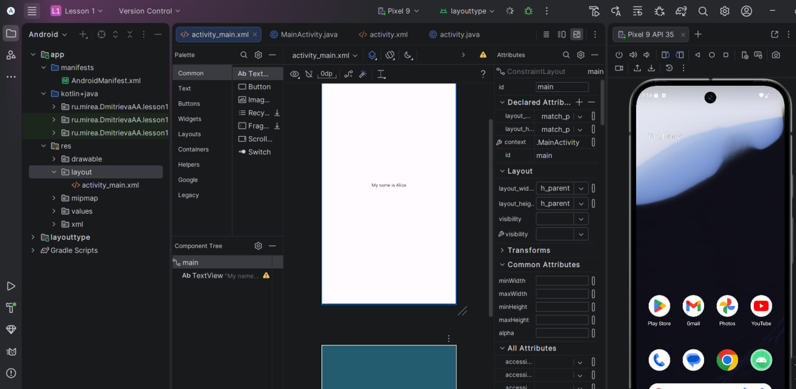
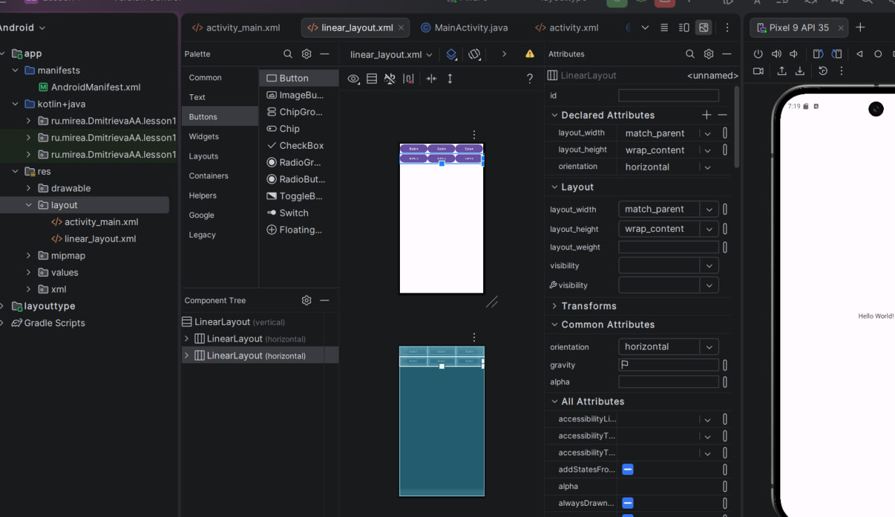
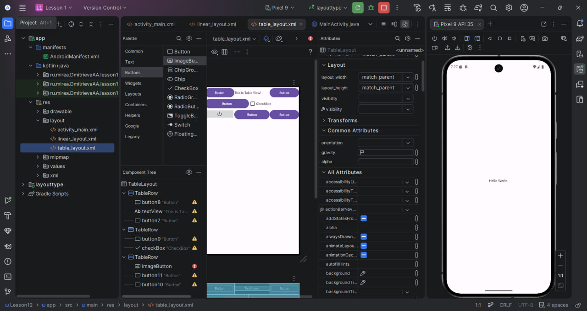
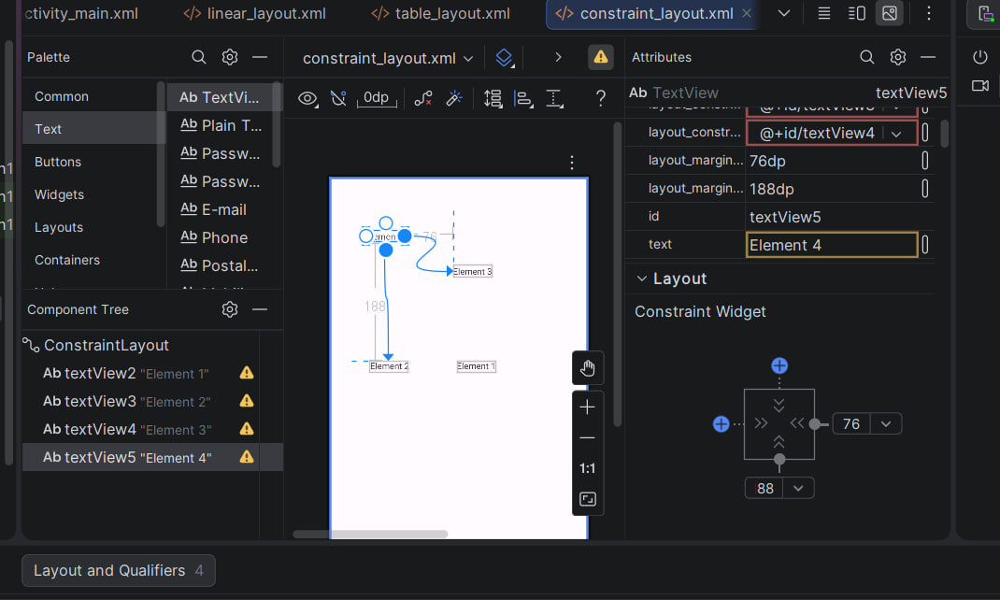
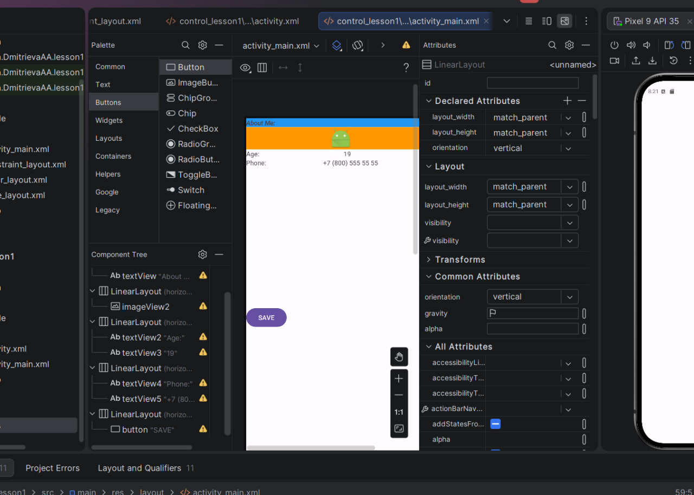
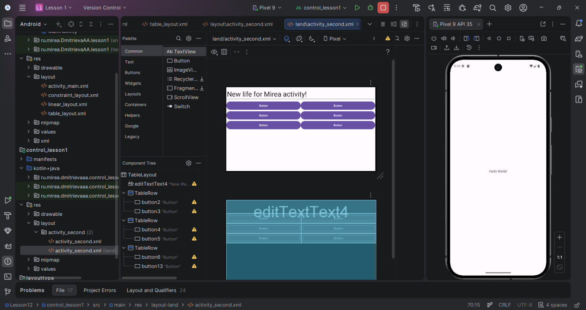
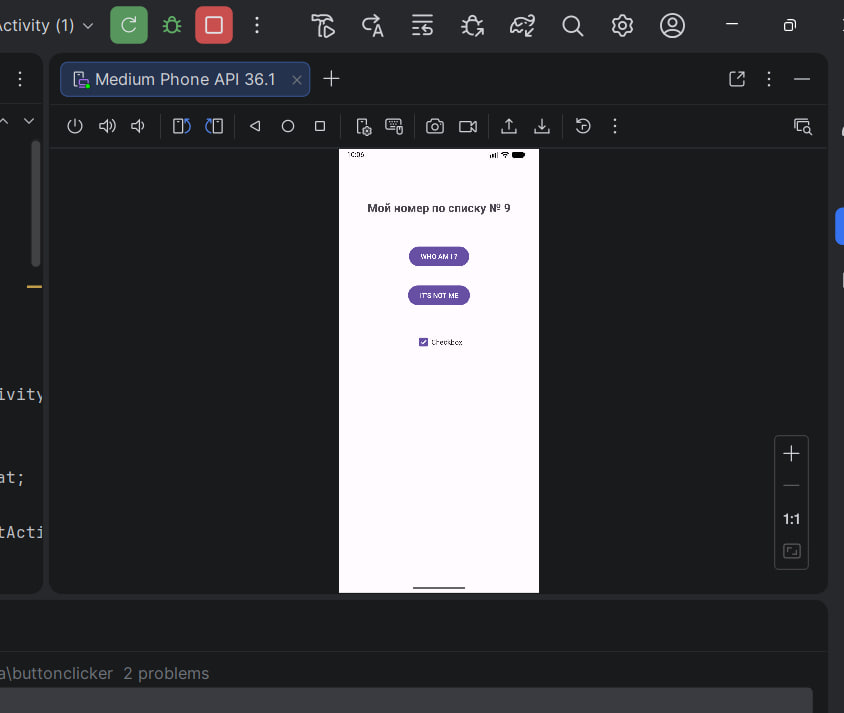

# Практическое занятие №1. Интеллектуальные мобильные приложения
«МИРЭА - Российский технологический университет»  
РТУ МИРЭА

**Направление подготовки:** 09.03.02 «Информационные системы и технологии»  
**Институт:** кибербезопасности и цифровых технологий  
**Кафедра:** КБ-14 «Цифровые технологии обработки данных»  
**Учебный год:** 2025/26

**Студент:** Дмитриева Алиса Антоновна  
**Группа:** БСБО-52-24

**Москва, 2025–2026**

## Глава 2. Введение в создание приложений

- Создан проект Lesson1 с минимальным API 26
- Пакетное имя: ru.mirea.dmitrievaaa.lesson1
- Создан эмулятор Pixel 9
- Запущено первое приложение (Hello World)

## Глава 3. Компоненты экрана и их свойства

- Изучены основные View: TextView, Button, CheckBox, EditText
- Добавлены элементы в activity_main.xml
- Изучены атрибуты (id, layout_width/height, text, textSize и др.)

Самостоятельно добавили элемент TextView на экран и изменили
отображаемый текст:  


## Глава 4. Виды Layout. Ключевые отличия и свойства

- Созданы файлы разметки: linear_layout.xml, table_layout.xml, constraint_layout.xml
- LinearLayout: вертикальное/горизонтальное расположение
- TableLayout: строки и столбцы
- ConstraintLayout: привязки (constraints)

Скриншоты реализованных макетов:  






## Глава 7. Обработчики событий (основное задание)

- Создан отдельный модуль buttonclicker
- Разметка activity_main.xml: TextView (tvOut), две кнопки, CheckBox
- Два способа обработки нажатий:
    1. setOnClickListener (анонимный класс) для кнопки WHO AM I ?
    2. android:onClick="onNotMeClick" + метод в Activity для IT'S NOT ME
- При нажатии изменяется текст TextView и состояние CheckBox
- Выводится Toast при использовании второго способа

Скриншоты работы приложения:  


Код MainActivity (фрагмент):

```java
tvOut = findViewById(R.id.tvOut);
btnWhoAmI = findViewById(R.id.btnWhoAmI);
checkBox = findViewById(R.id.checkBox);

btnWhoAmI.setOnClickListener(v -> {
    tvOut.setText("Мой номер по списку № 9");
    checkBox.setChecked(true);
});

public void onNotMeClick(View view) {
    tvOut.setText("Это не я сделал");
    checkBox.setChecked(false);
    Toast.makeText(this, "Ещё один способ!", Toast.LENGTH_SHORT).show();
}