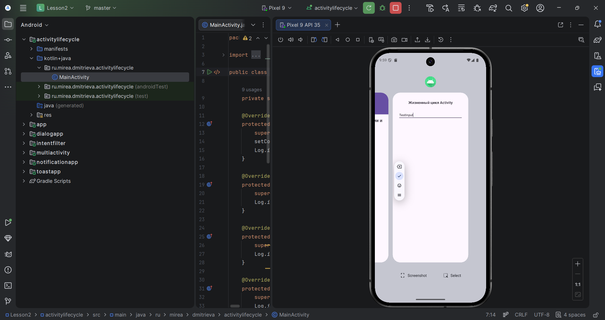
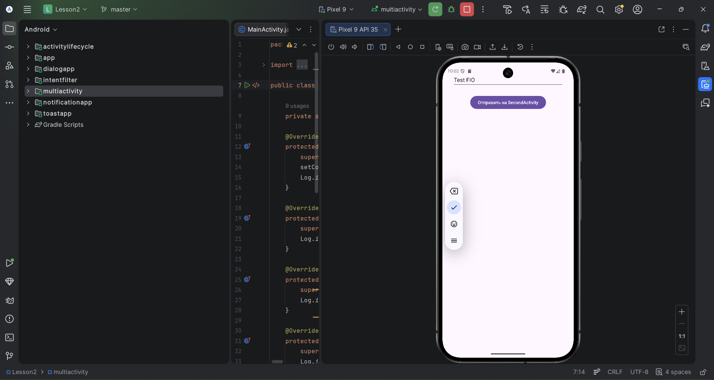
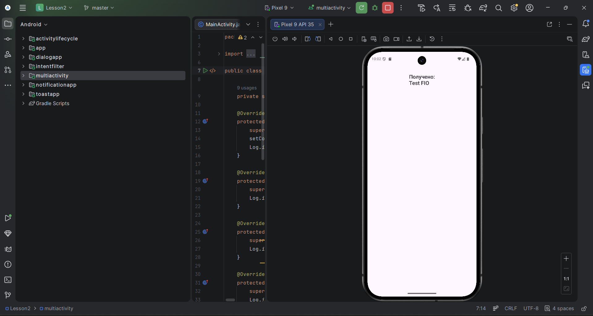
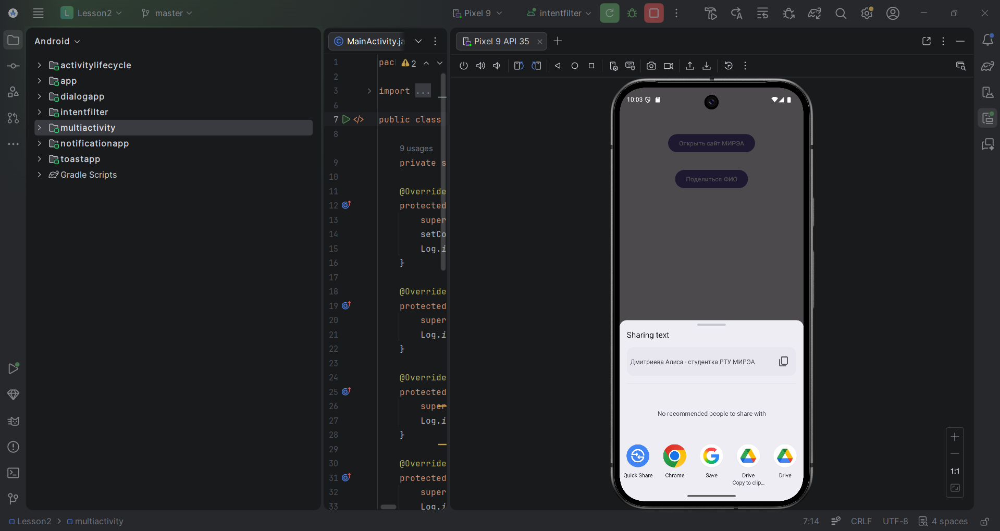
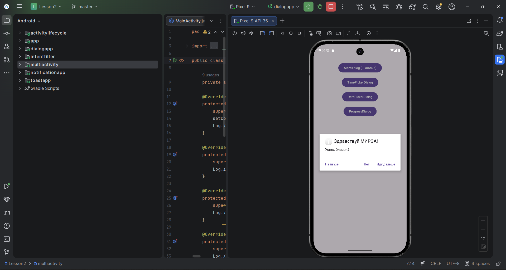
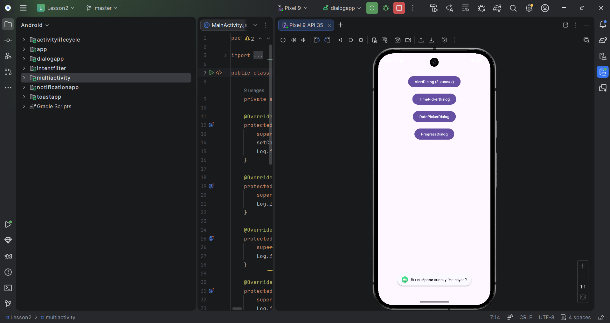
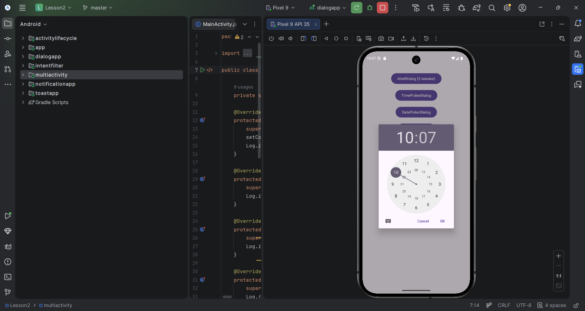
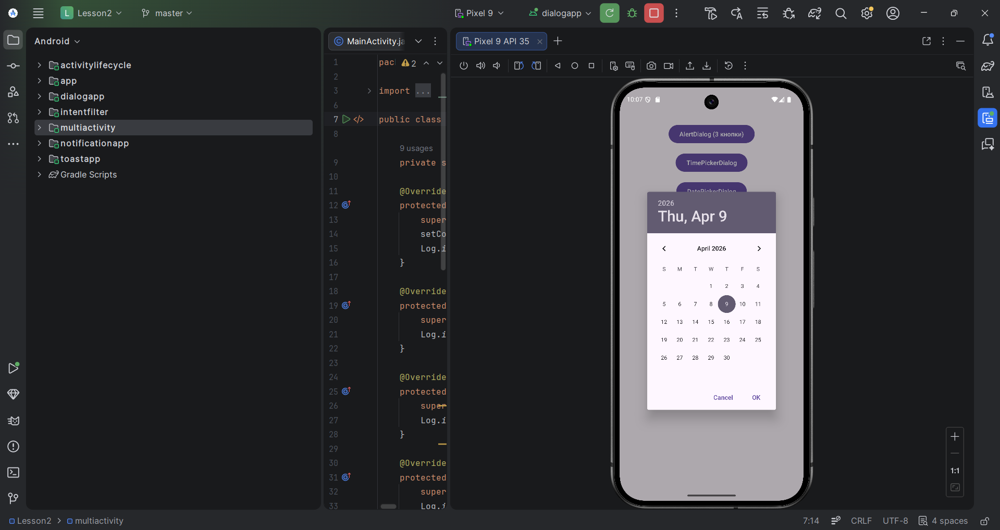
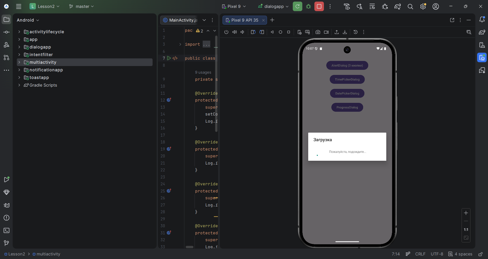

# Практическая работа №2  
## Интеллектуальные мобильные приложения

**Дисциплина:** Интеллектуальные мобильные приложения  
**Студент:** Дмитриева А.А.
**Группа:** БСБО-52-24
**Вуз:** РТУ МИРЭА  
**Год:** 2026

---

## Цель работы

Изучить:
- жизненный цикл `Activity`;
- явные и неявные `Intent`;
- всплывающие уведомления `Toast`;
- системные уведомления `Notification`;
- диалоговые окна `DialogFragment`, `TimePickerDialog`, `DatePickerDialog`, `ProgressDialog`.

---

## Содержание работы

В рамках практической работы были выполнены следующие задания:

1. Изучение жизненного цикла `Activity`;
2. Создание и вызов `Activity` через явные намерения;
3. Работа с неявными намерениями;
4. Создание всплывающих уведомлений `Toast`;
5. Создание системных уведомлений `Notification`;
6. Создание диалоговых окон через `DialogFragment`;
7. Самостоятельная работа с:
   - `Snackbar`
   - `TimePickerDialog`
   - `DatePickerDialog`
   - `ProgressDialog`

---

# 1. ActivityLifecycle

## Описание

Был создан модуль `ActivityLifecycle`, в котором переопределены основные методы жизненного цикла `Activity`:

- `onCreate()`
- `onStart()`
- `onResume()`
- `onPause()`
- `onStop()`
- `onRestart()`
- `onDestroy()`

Для отслеживания вызовов использовался класс `Log`

## Пример кода

```
@Override
protected void onStart() {
    super.onStart();
    Log.i(TAG, "onStart()");
}
```

Промежуточный вывод:
При сворачивании приложения через кнопку Home метод onCreate() повторно не вызывается, если система не уничтожила процесс
Значение EditText после возврата через Home сохраняется
После нажатия Back активность завершается, и при новом запуске значение поля обычно не сохраняется



# 2. MultiActivity

## Описание

Был создан модуль MultiActivity, демонстрирующий переход между двумя активностями при помощи явного Intent
Из MainActivity выполняется переход во SecondActivity, а также передача текста через Intent

## Пример кода:
```
public void onClickNewActivity(View view) {
    Intent intent = new Intent(this, SecondActivity.class);
    intent.putExtra("key", "Дмитриева Алиса Антоновна");
    startActivity(intent);
}
```

Во второй активности полученное значение отображается в TextView.

```
String text = (String) getIntent().getSerializableExtra("key");
textView.setText(text);
```

Промежуточный вывод:
Была реализована передача данных между двумя экранами приложения с использованием Intent




# 3. IntentFilter

## Описание

Был создан модуль IntentFilter, в котором реализованы неявные Intent

## Реализовано:
открытие сайта МИРЭА в браузере и
передача текста в другое приложение через ACTION_SEND

## Пример кода:
```
Uri address = Uri.parse("https://www.mirea.ru/");
Intent openLinkIntent = new Intent(Intent.ACTION_VIEW, address);
startActivity(openLinkIntent);

Intent shareIntent = new Intent(Intent.ACTION_SEND);
shareIntent.setType("text/plain");
shareIntent.putExtra(Intent.EXTRA_SUBJECT, "MIREA");
shareIntent.putExtra(Intent.EXTRA_TEXT, "ДМИТРИЕВА АЛИСА АНТОНОВНА");
startActivity(Intent.createChooser(shareIntent, "МОИ ФИО"));
```

Промежуточный вывод:
Неявные намерения позволяют запускать внешние приложения без указания конкретного класса Activity



# 4. ToastApp

## Описание

Был создан модуль ToastApp, в котором реализовано всплывающее уведомление Toast
Пользователь вводит текст в поле ввода, после чего по нажатию кнопки отображается количество символов

## Пример кода:
```
Toast toast = Toast.makeText(
        getApplicationContext(),
        "СТУДЕНТ № 9 ГРУППА БСБО-52-24 Количество символов - " + text.length(),
        Toast.LENGTH_SHORT
);
toast.show();
```

Промежуточный вывод:
Toast удобно использовать для коротких сообщений, не требующих ответа пользователя


# 5. NotificationApp

## Описание

Был создан модуль NotificationApp, в котором реализована отправка системного уведомления

Также было добавлено разрешение:
```
<uses-permission android:name="android.permission.POST_NOTIFICATIONS" />
```

Промежуточный вывод:
Была изучена работа с NotificationManager, каналами уведомлений и разрешениями в Android 13+


# 6. Dialog

## Описание

Был создан модуль Dialog, в котором реализовано диалоговое окно на основе DialogFragment

Использовался класс MyDialogFragment, содержащий AlertDialog с тремя кнопками:

Иду дальше |
На паузе |
Нет

При нажатии на кнопки вызываются методы MainActivity, которые отображают Toast

Пример кода:
```
builder.setTitle("Здравствуй МИРЭА!")
        .setMessage("Успех близок?")
        .setIcon(R.mipmap.ic_launcher_round)
        .setPositiveButton("Иду дальше", new DialogInterface.OnClickListener() {
            public void onClick(DialogInterface dialog, int id) {
                ((MainActivity)getActivity()).onOkClicked();
                dialog.cancel();
            }
        })
        .setNeutralButton("На паузе", new DialogInterface.OnClickListener() {
            public void onClick(DialogInterface dialog, int id) {
                ((MainActivity)getActivity()).onNeutralClicked();
                dialog.cancel();
            }
        })
        .setNegativeButton("Нет", new DialogInterface.OnClickListener() {
            public void onClick(DialogInterface dialog, int id) {
                ((MainActivity)getActivity()).onCancelClicked();
                dialog.cancel();
            }
        });
```

Методы в MainActivity:
```
public void onOkClicked() {
    Toast.makeText(getApplicationContext(), "Вы выбрали кнопку \"Иду дальше\"!", Toast.LENGTH_LONG).show();
}

public void onCancelClicked() {
    Toast.makeText(getApplicationContext(), "Вы выбрали кнопку \"Нет\"!", Toast.LENGTH_LONG).show();
}

public void onNeutralClicked() {
    Toast.makeText(getApplicationContext(), "Вы выбрали кнопку \"На паузе\"!", Toast.LENGTH_LONG).show();
}
```

Промежуточный вывод:
Было реализовано взаимодействие между DialogFragment и Activity через вызов методов родительской активности




# 7. Самостоятельная работа

## Описание

В рамках самостоятельной работы были изучены:
```
Snackbar
TimePickerDialog
DatePickerDialog
ProgressDialog
Реализованные классы
MyTimeDialogFragment
MyDateDialogFragment
MyProgressDialogFragment
```

В activity_main.xml были добавлены три кнопки для вызова соответствующих диалоговых окон

Краткое описание:

```MyTimeDialogFragment```
Позволяет выбрать время с помощью TimePickerDialog

```MyDateDialogFragment```
Позволяет выбрать дату с помощью DatePickerDialog

```MyProgressDialogFragment```
Отображает окно прогресса выполнения операции






## Итоговый вывод:
В ходе выполнения практической работы были изучены основные механизмы взаимодействия пользователя с Android-приложением: жизненный цикл Activity, переходы между экранами, работа с Intent, всплывающими уведомлениями, системными уведомлениями и диалоговыми окнами
Практика позволила закрепить навыки создания многоэкранных приложений и организации пользовательского интерфейса средствами Android SDK